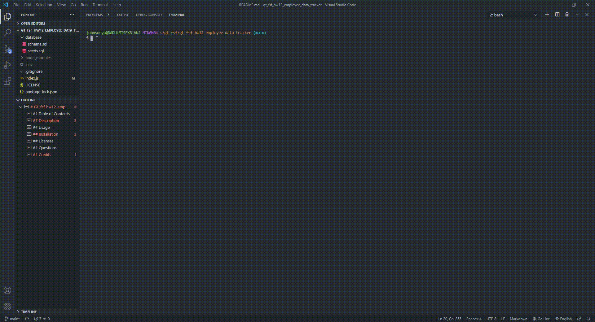

# GT_fsf_hw12_employee_tracker
## Table of Contents
1. [Description](#Description)
3. [Usage](#Usage)
4. [Installation](#Installation)
5. [Licenses](#Licenses)
6. [Questions](#Questions)
7. [Credits](#Credits)

## Description
This assignment asks us to setup an MySQL DB and utilize that along with nodejs and other related libraries to create an application for managing a companies employee data. I used the Atlanta Falcons as an example. Due to time constraints the week of this assignment I was not able to dive into the bonus, but was able to satisfy the acceptance criteria as well as include some validation and escape routes from various prompt sequences. 

**Demo Video For Main Application**  
The below demo demonstrates a bit of everything, as you can see the process for adding departments, roles, employees as well as viewing information and updating existing roles for current employees (I have a standalone view information option but I included these after any add or update sequence so that the user can see their change reflected already in the DB). 

In the sequence below you can see me promoting myself to QB of the dirty birds while also demoting Matty Ice to the Practice Squad. You can also see the escapes I build into prompts to ensure data is added in a way that maintains it as a relational database. 

Additional videos of each separate view, add, update functionalities can be found via access of the links to a google drive below.

For this assignment, I did not utilize classes and constructors. I think I probably over coded this although I am confident it functions correctly. I did however utilize a very functional programming logic, as my entire script is broken into organized, mostly independent functions (see below). Had I had more time to investigate this or refactor, I would have split my functions to different pages and imported them and I would have looked further into how I should have utilized constructors and classes to be less dry in my code. I would have also reconsidered how I manage dynamically populating choices in my prompts. For this assignment I pulled latest data from the db each time a task was completed or the program was started, as this data was used to support the prompt sequences. If it were a large dataset though, this would likely not be an efficient way to do it. 

I used my schema and seeds file with SQL workbench to inject some test data for use in building and testing this application.

**Screenshot of my Functional Programming Layout for main sequence** 

**Screenshot of my Functional Programming Layout for prompts, connection and utility type functions** 

**Link to google drive with videos of each individual functionality for view, add, and update** 

INSER LINK

## Usage
This application can be used to manage a basic employee database. Using the CLI, users can view, add, or update information to a relational database holding information about departments, roles, and employees. 

## Installation
To install this application you just need to ensure that you have nodeJS and run the npm i command to get required dependencies (inquirer and mysql). 

## Licenses
  
https://opensource.org/licenses/MIT

## Questions
Email me at ryanjohnson9685@gmail.com for more information.

## Credits
For this assignment I utilized class notes and recordings, as well as some MDM and W3 schools. I also reviewed the npm documentation for for specific questions dealing with use of third party libraries.
